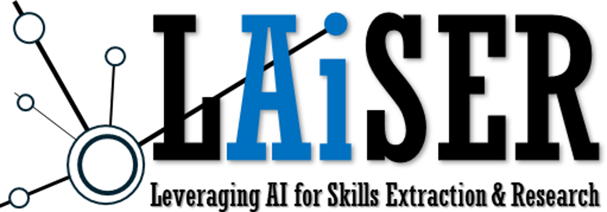

<!-- Show an image in assets directory here -->

# LAiSER V0.2

## Introduction
Leveraging ​Artificial ​Intelligence for ​Skill ​Extraction &​ Research (LAiSER) is a tool that helps learners, educators and employers share trusted and mutually intelligible information about skills​. 

## Features
- **Skills Extraction**: Extract skills from job descriptions, course syllabi, resumes, and other text sources.
- **Skills Mapping**: Map extracted skills to a common taxonomy (underlying implementation of taxonomy is subject to changes).
- **Levels Mapping**: Map extracted skills to levels from 1 to 12.
- **Knowledge Required**: Knowledge required to gain extracted skills.
- **Task Abilities**: Task that can be performed using extracted skills.

## Getting Started
- [Installation](installation.md)
- [Usage](usage.md)
- [Contributing](contributing.md)
- [License](license.md)

