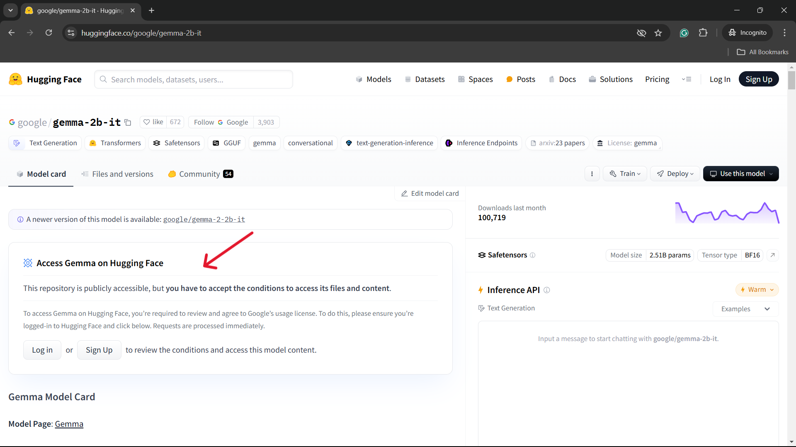
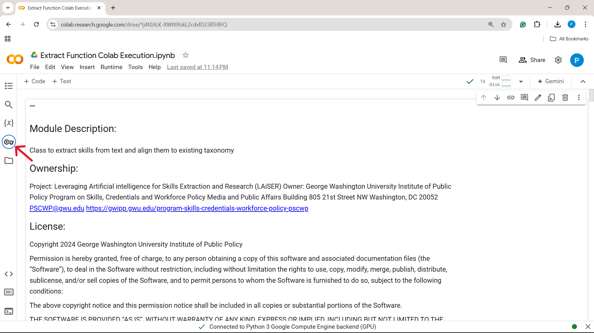
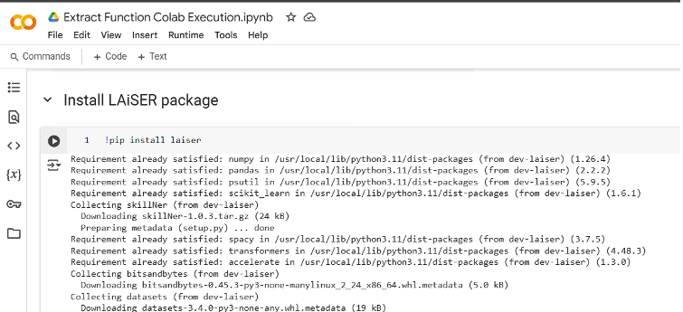
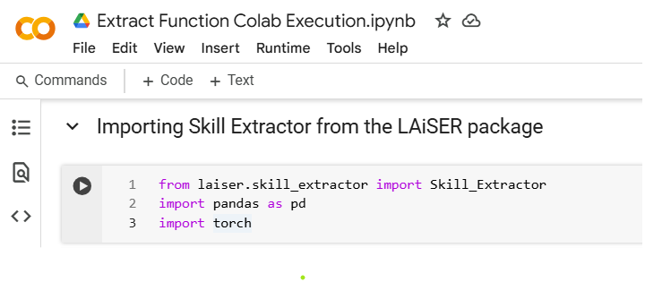
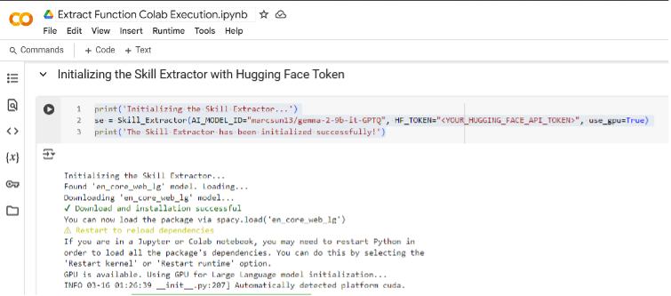
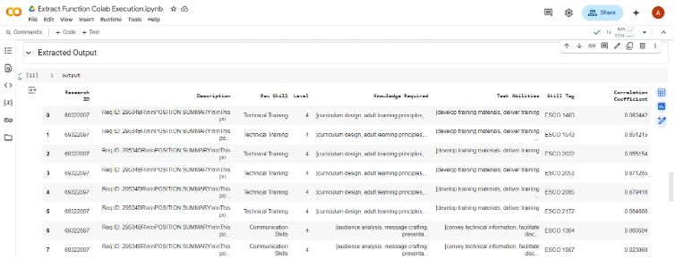

# Usage and Output

As of now LAiSER can be used a command line tool or from the Jupyter notebook(Google Colab). The steps to setup the tool are as follows:


### Google Colab Setup (preferred)
LAiSER's Jupyter notebook is, currently, the fastest way to get started with the tool. You can access the notebook [here](https://github.com/LAiSER-Software/extract-module/blob/development/dev_space/Extract%20Function%20Colab%20Execution.ipynb)

- Once the notebook is imported in google colaboratory, connect to a GPU-accelerated runtime(T4 GPU) and run the cells in the notebook.


#### HuggingFace Setup

- Follow [this](https://www.educative.io/answers/how-to-get-an-access-token-for-hugging-face) article to create an account in HuggingFace and activate access tokens to access the models.


#### Request Gemma Access

- Open [this](https://huggingface.co/google/gemma-2b-it) link to request access for the `google/gemma-2b-it` model.



- Follow through the instructions provided in the page and send access request by filling out the requested details.


#### Create Colab Secret Keys

- Click the keys (can be found in the below image) button.



- Fill `HF_TOKEN` in the Name field and your huggingface access token in the value field.


### LAiSER package Installation

- Install the laiser package using pip:

```shell
  pip install laiser
```



### Importing Skill Extractor 

- Import Skill Extractor from laiser.

 ```shell
   from laiser.skill_extractor import Skill_Extractor
 ```
!!!note "NOTE"
 > Import pandas and torch libraries to handle data and GPU-accelerated computations.

- Install additional libraries:
  
 ```shell
    import pandas as pd
    import torch
 ```



### Initializing Extractor

- To initialize the skill extractor follow these steps:

 ```shell
  se = Skill_Extractor(AI_MODEL_ID="marcsun13/gemma-2-9b-it-GPTQ", HF_TOKEN="<YOUR_HUGGING_FACE_API_TOKEN>", use_gpu=True)
 ```



### Output



Output Column Descriptions:

- `Research ID` - Unique ID of each job description.
- `Raw Skill` - Skill Extracted by the model.
- `Level` - Skill level mapped basis the description between 1 to 12.
- `Knowledge Required` - Knowledge required to gain the extarcted skill.
- `Task Abilities` - Tasks that ca be performed using the extracted skill.
- `Skill Tag` - Unique ID of taxonomy skill that matches the Raw Skill.
- `Correlation Coefficient` - Describes the closeness of Raw Skill and Skill Tag.
