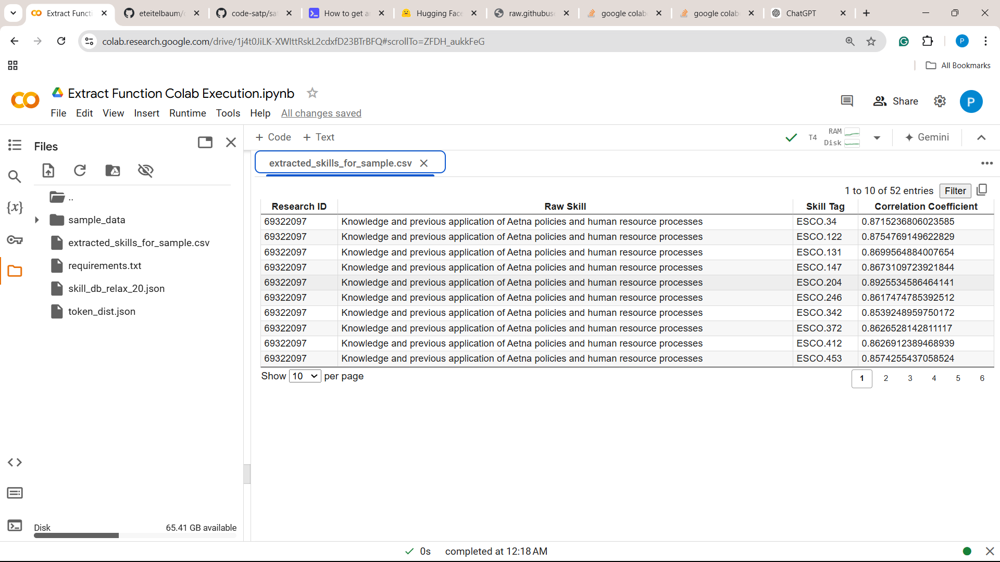

# Usage and Output

As of now LAiSER can be used a command line tool or from the Jupyter notebook(Google Colab). The steps to setup the tool are as follows:

### Google Colab Setup (preferred)
LAiSER's Jupyter notebook is, currently, the fastest way to get started with the tool. You can access the notebook [here](https://github.com/LAiSER-Software/extract-module/blob/main/notebooks/Extract%20Function%20Colab%20Execution.ipynb)

- Once the notebook is imported in google colaboratory, connect to a GPU-accelerated runtime(T4 GPU) and run the cells in the notebook.


#### HuggingFace Setup

- Follow [this](https://www.educative.io/answers/how-to-get-an-access-token-for-hugging-face) article to create an account in HuggingFace and activate access tokens to access the models.

#### Request Gemma Access

- Open [this](https://huggingface.co/google/gemma-2b-it) link to request access for the `google/gemma-2b-it` model.


- Follow through the instructions provided in the page and send access request by filling out the requested details.


#### Create Colab Secret Keys

- Click the keys (can be found in the below image) button.


- Fill `HF_TOKEN` in the Name field and your huggingface access token in the value field.


### Command Line Setup
To use LAiSER as a command line tool, follow the steps below:

- Navigate to the root directory of the repository and run the command below:

```py
  python main.py
```

!!! note "CAUTION"
    - If you encounter any `*.dll` file missing errors, make sure you downgrade the pytorch version to `2.2.2`.
    ```shell
      pip install pytorch=2.2.2
    ```

### Output



Output Column Descriptions:

- `Research ID` - Unique ID of each job description.
- `Raw Skill` - Skill Extracted by the model.
- `Skill Tag` - Unique ID of taxonomy skill that matches the Raw Skill.
- `Correlation Coefficient` - Describes the closeness of Raw Skill and Skill Tag.